# Lab Exercise 

>**Please note that the images used in the lab guide are representative and NOT based on any specific pod. Please use the information in the lab guide instead.**

## Getting started ##

Cisco Application Centric Infrastructure (ACI) technology provides the capability to insert Layer 4 through Layer 7 (L4-L7) functions using an approach called a service graph. The servive graph controls network connectivity consisting of VLANs.

Lab will be used to demonstrate L4-L7 service insertion in unmanaged mode to simulate an enterprise network and/or cloud provider’s application delivery offering while allowing the application owner to manage the L4-L7 device using Ansible. 

The topology used for this Lab is as follows:

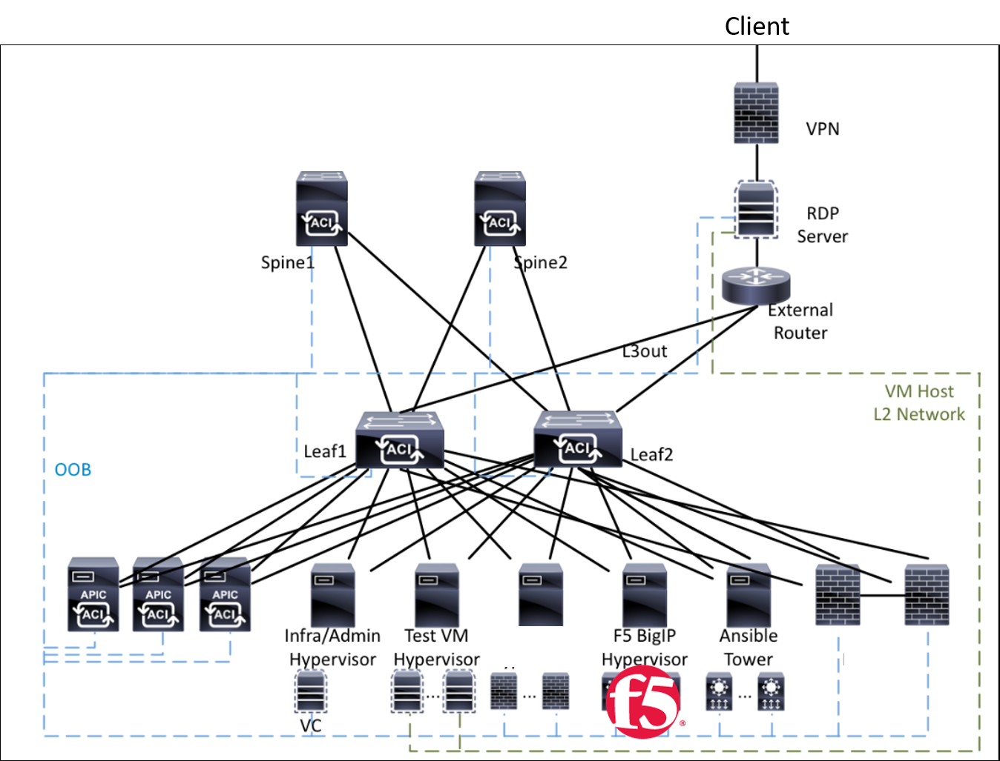

The goal is to provide a central point of control to configure both the Cisco APIC as well as the F5 BIG-IP. Network stitching is achieved by automating the deployment of a service graph on APIC and L4-L7 configuration is automated directly on the BIG-IP

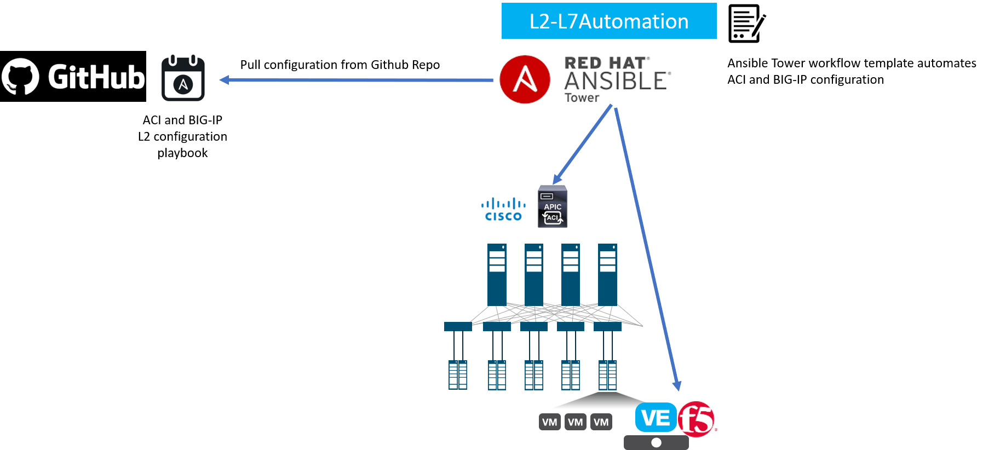

**For this lab**
* We will use the F5 BIG-IP VE Virtual ADC to demonstrate this functionality
* The service graph will be deployed in One-ARM mode which implies **one** interface will be consumed on the BIG-IP which handles the client as well as server traffic
* A default route will be configured on the BIG-IP
* SNAT = 'Automap' will be configured on the BIG-IP (return traffic from backend servers are forced to pass back through the BIG-IP)
* The EPG's used are **web-epg**(provider) and **l3out-epg** (consumer). Bridge domain **vip-bd**

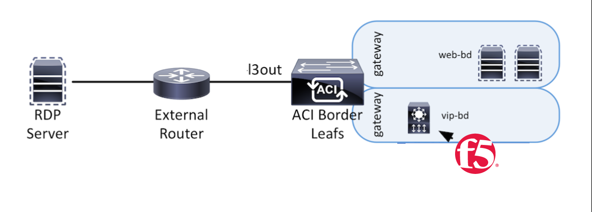

**Let's begin the lab**

## Automate configuration on APIC and BIG-IP using Ansible

We will provision the APIC and BIG-IP using Ansible for a couple of reasons. Ansible is an open source automation platform that can help with configuration management, application deployment, and task automation. It can also do IT orchestration, where you have to run tasks in sequence and create a chain of events which must happen on several different servers or devices.

Red Hat Ansible Tower provides a single point of control your IT infrastructure with a visual dashboard, role-based access control, job scheduling, integrated notifications and graphical inventory management. 

Connect to the Ansible tower using the following information:

* **Ansible Tower Address**: 172.21.208.250
* **username**: {TSTUDENT}
* **password**: cisco123

Once you are logged in click on **Projects** located in the top level menu
Click on **Lab-Git-Project**. This is a view only permission.

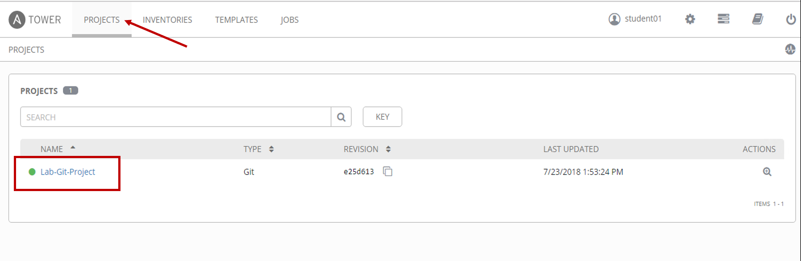

The SCM URL defines the Github repo from where the playbooks and other content is being pulled from.

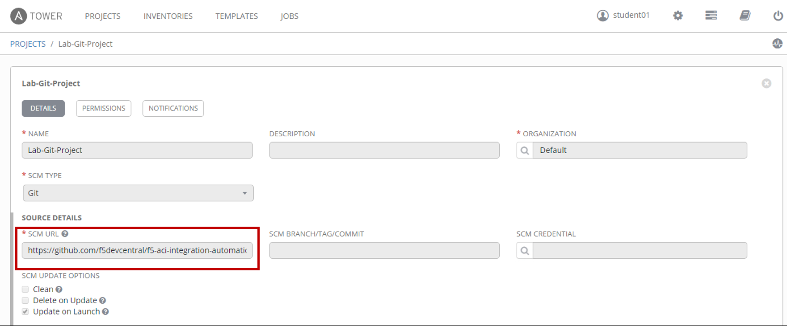

Click on **Templates** located in the top level menu: 

Click on the template **Configure-ACI**
* This is a view only template. This template will not be launched.
* There is a project associated with the template (which is the GIT project).
* There is a ansible playbook associated with the template (pulled from GIT - aci_configuration.yaml).


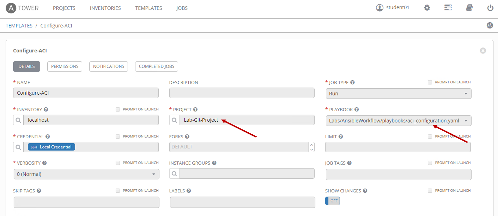

**Playbook contents - aci_configuration.yaml** - To view contents [click here](https://github.com/f5devcentral/f5-aci-integration-automation-ansible/blob/master/Labs/AnsibleWorkflow/playbooks/aci_configuration.yaml)
* Take as input Jinga2 files and covert them to XML files
	* Jinga2 files allow the user to variabalize the content as needed. To view the Jinga2 files used for this playbook [click here](https://github.com/f5devcentral/f5-aci-integration-automation-ansible/tree/master/Labs/AnsibleWorkflow/aci_posts-OneArmDeployment)
* Use the aci_rest Ansible module and post the XML files created in the above step to ACI. Following is what is getting configured on the APIC. To view the playbook contents [click here](https://github.com/f5devcentral/f5-aci-integration-automation-ansible/blob/master/Labs/AnsibleWorkflow/playbooks/aci_configuration.yaml)
	* Logical Device Cluster
	* Contract
	* Service graph template
	* Attach service graph template to contract
		* Device selection policy
		* Assign provided contract to provider EPG
		* Assign consumer contract to consumer EPG

Back on Ansible tower scroll down -> Click on the template **Configure-BIG-IP**
* This is a view only template. This template will not be launched.
* There is a project associated with the template (which is the GIT project).
* There is a ansible playbook associated with the template (pulled from GIT - bigip_configuration.yaml).


**Playbook contents - bigip_configuration.yaml** - To view contents [click here](https://github.com/f5devcentral/f5-aci-integration-automation-ansible/blob/master/Labs/AnsibleWorkflow/playbooks/bigip_configuration.yaml)
* Calls another playbook named **onboarding.yaml** to configure onboarding tasks. To view contents [click here](https://github.com/f5devcentral/f5-aci-integration-automation-ansible/blob/master/Labs/AnsibleWorkflow/common/onboarding.yaml)
	* NTP
	* DNS
	* Hostname
	* SSHD setting
* Configures the network
	* VLAN
	* Self-IP
	* Static route
* Calls another playbook names **http-service.yaml** to configure L7 tasks. To view contents [click here](https://github.com/f5devcentral/f5-aci-integration-automation-ansible/blob/master/Labs/AnsibleWorkflow/common/http_service.yaml)
	* Node members
	* Pool
	* Virtual Server

Go back to Ansible Tower. A workflow has been created in Ansible Tower to chain the execution of the above two playbooks

Scroll down -> Click on the template **Configure-Workflow**. 
This is a workflow template consisting of two playbooks we viewed earlier
1) Configure-ACI
2) Configure-BIG-IP

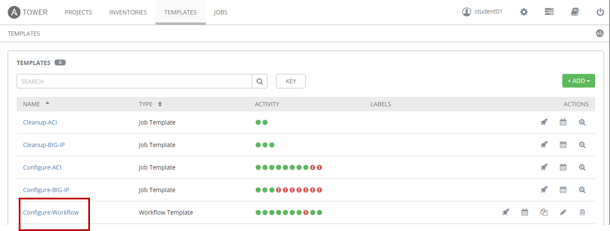

Click on the 'Workflow Editor' button to view the workflow configured

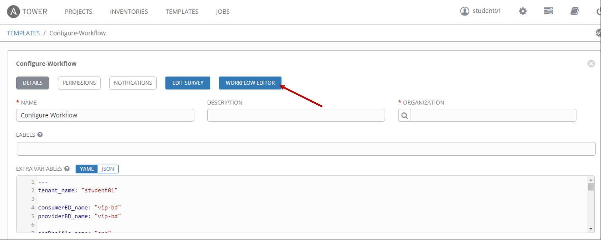

After viewing 'close' the workflow editor

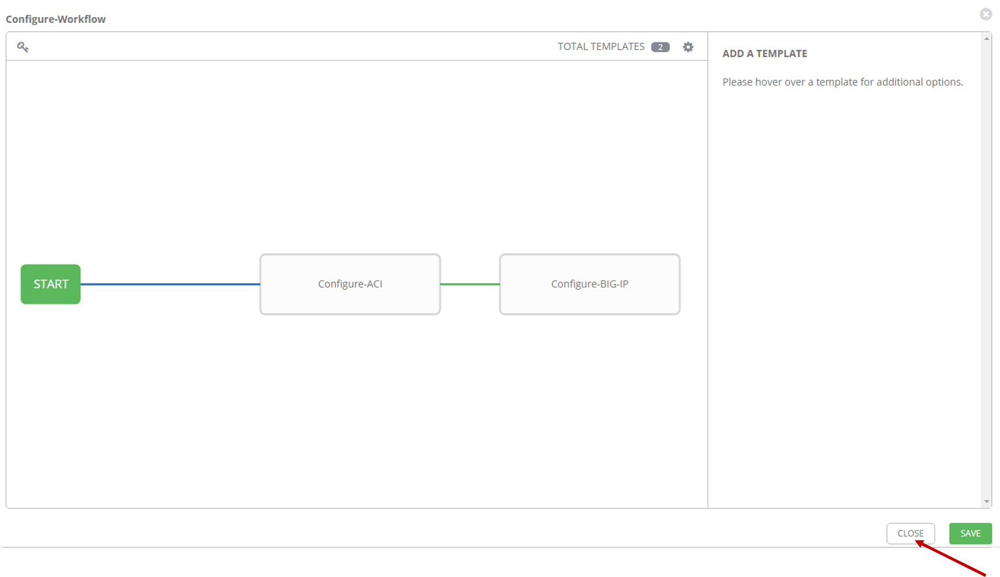

Now we will view the parameters that we are going to pass to the playbook for execution. There are two methods through which we are passing variables to the playbook. One is through the **Extra Variables** text box and the other is through the **Survey**

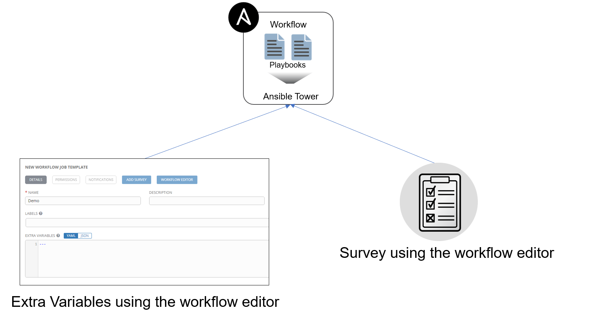

View the paramters in the **Extra Variables** text box. Values that you provide here will be provided as input to the playbooks in the workflow

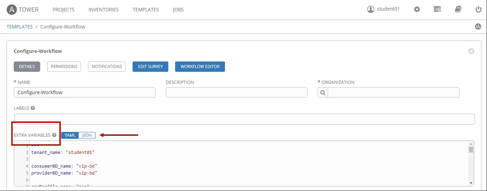


Scroll through and make sure the following paramters are specified:

```
#################
#APIC information
#################
consumerBD_name: "vip-bd" 			#Consumer Bridge domain name
providerBD_name: "vip-bd"			#Provider bridge domain name

appProfile_name: "app"				#Application profile name
consumerEPG_name: "epg-l3out"			#Consumer EPG name
providerEPG_name: "web-epg" 			#Provider EPG name

SGtemplate_name: "sgt"				#Service graph template name
contract_name: "cntr"				#Contract name

logicalDeviceCluster_name: "bigip"		#Logical Device Cluster name

#################
#BIG-IP information
#################

vlan_information:
- name: "VLAN"
  id: "1234"					#Vlan ID
  interface: "1.1"  				#Interface on BIG-IP to which the VLAN is untagged

bigip_selfip_information:
- name: 'SelfIP'
  address: '69.2.101.10'			#Self-IP address
  netmask: '255.255.255.0'  
  vlan: "{{vlan_information[0]['name']}}"	#VLAN to be assinged to the BIG-IP

static_route:
- name: "default"
  gw_address: "69.2.101.1"			#Default gateway assigned on the BIG-IP
  destination: "0.0.0.0"
  netmask: "0.0.0.0"

pools:
- pool_name: "http-pool"			#Pool name
  pool_members:					#Members belonging to the BIG-IP Pool
   - port: "80"
     host: "69.2.1.100"
   - port: "80"
     host: "69.2.1.101"
	 
vips:
- vip_name: "http"				#Virtual IP Name
  vip_port: "80"
  vip_ip: "69.2.101.11"				#IP address where the client traffic will be directed to
  snat: "automap"				#SNAT set to automap, so that return traffic is forced back to the BIG-IP
						#No changes needed on the network routing on the backend servers (pool members)
  pool_name: "http-pool"			#Pool to be assigned to the VIP
  profiles:					#Profiles to be assigned to the VIP
   - http
```

Scroll to the bottom and click on the 'Rocket' icon next to the template.

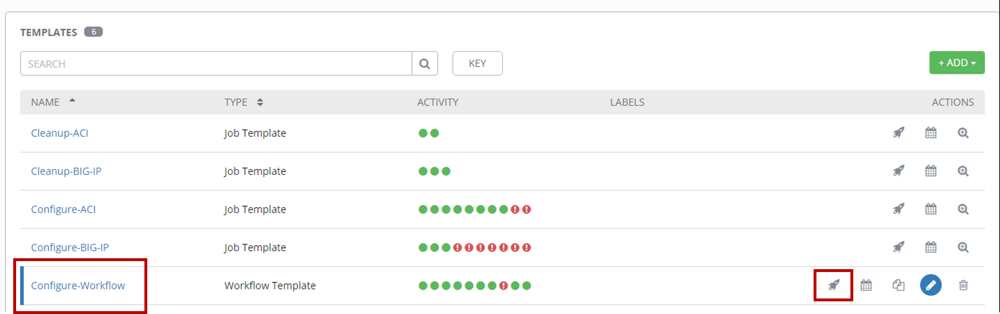

This will launch the playbook. A survey will pop up when the rocket button is clicked.
The survey is an Ansible Tower feature to allow users to provide input to the playbook while executing the playbook. These are variables passed to the playbook along with the input provided in the 'Extra Variables' text box earlier.

```
In the Survey enter the following:
BIG-IP - device type = 'virtual'
BIG-IP - High Availability or Stand Alone = "SA"
BIG-IP - Do you want to on-board? = 'yes'
BIG-IP - Deploy L7 configuration? = 'yes'
BIG-IP IPAddress = '172.21.208.109'
BIG-IP username = 'admin'
BIG-IP password = 'cisco123'
APIC IPAddress = '172.21.208.173'
APIC username = 'studentxx'	#Replace xx to your student ID
APIC password = 'ciscolive.2018'
APIC Tenant Name = 'studentxx'	#Replace xx to your student ID
```
Click Launch once the Survey is filled according to the parameters above

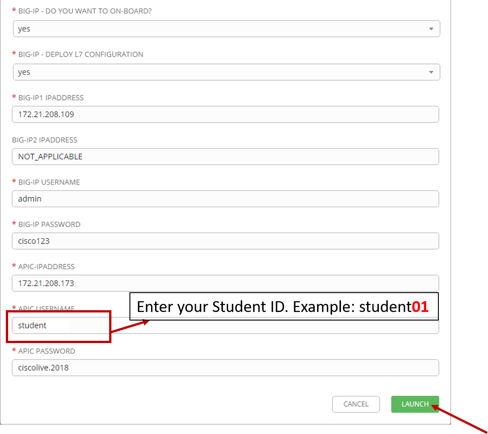

At this point the playbook is executing. It will first configure the APIC and then the BIG-IP

You will see the status of the playbook is in mode **Running**. The workflow will first execute Configure-ACI playbook. Click on details

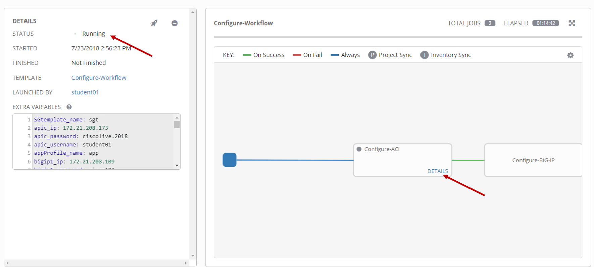

The new window will indicate the progress of running playbook **Configure-ACI**

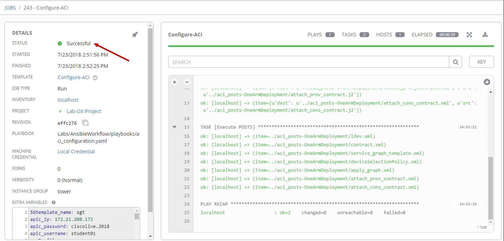

After the playbook has executed sucessfully click on **Jobs** on the top left hand corner

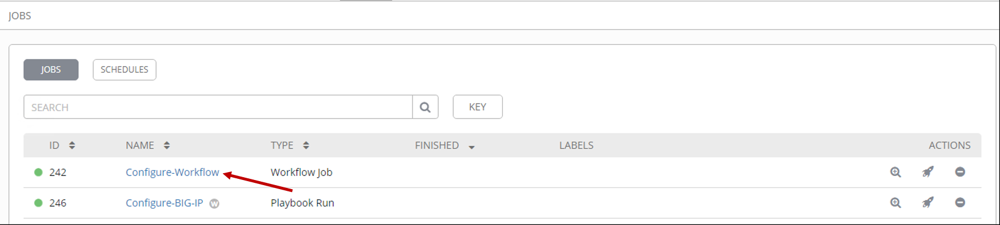

You will see the Configure-Workflow job being executed (blinking green icon next to it), click it. It will take you back to the workflow execution, at this point the **Configure-ACI** playbook would have executed sucessfully and the playbook **Configure-BIG-IP** will be getting executed. Click on details

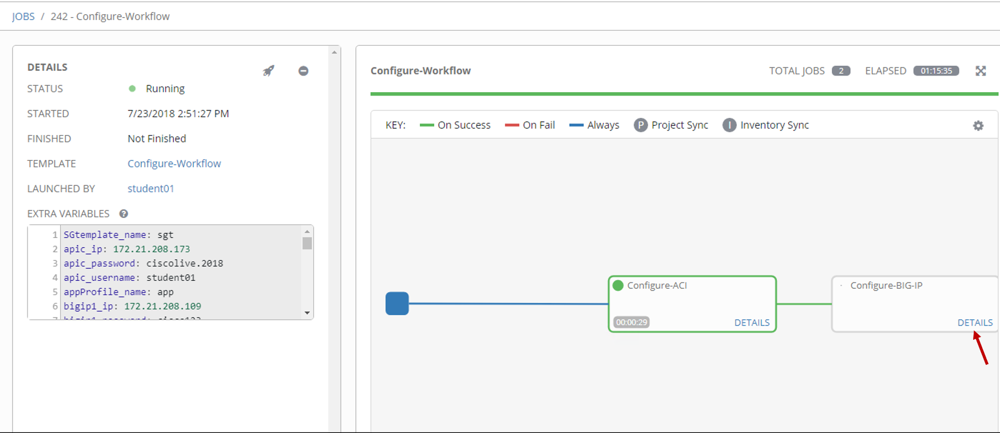

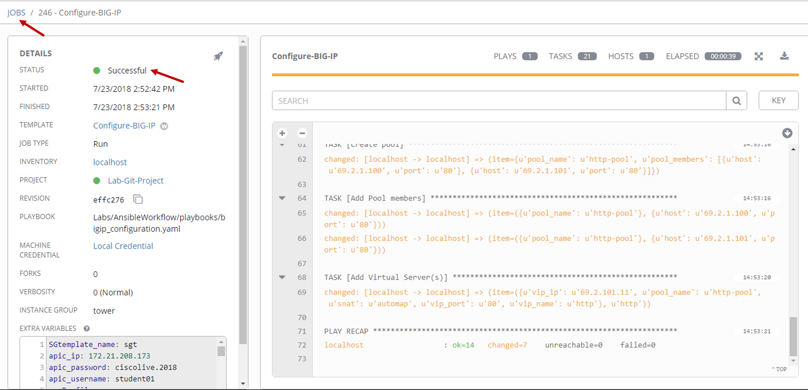

Once the playbook has executed sucessfully again click on **Jobs**. You will see five jobs got executed as part of the workflow. From the bottom

* Git project SCM update (before a playbook is run the GIT repo is updated to make sure the latest code is available)
* Configure-ACI
* Git project SCM update
* Configure-BIG-IP
* Workflow execution

The JOB ID in the screen shot does not need to match what you see

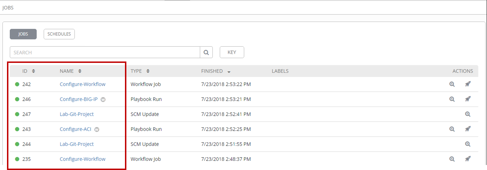

**This concludes the section on using Ansible playbooks to configure APIC and BIG-IP**

## Verifying the Deployment

### Verify APIC configuration
Let's login into the APIC with the following username and password from the web browser

* APIC : http://172.21.208.173
* Username: {TSTUDENT}
* Password: ciscolive.2018

On the APIC GUI click on **Tenants**. In the Tenant Search text box enter your student ID. Example: student01. This will open up your tenant on the left hand side of the APIC GUI pane

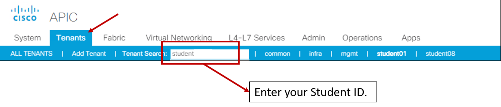

In the left hand pane under your tenant to view the logical device cluster deployed click on **Services->L4-L7->Devices->bigip**

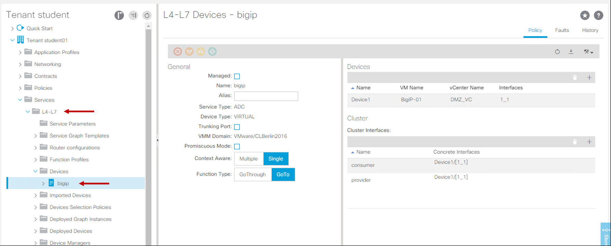

In the logical device cluster the following has been configured
* Name: **bigip**  
* Service Type: **ADC**  
* Device Type: **Virtual**  
* VMM Domain: **VMware/CLBerlin2016** 
* View: **Single Node**
* Context Aware: **Single**  
* Function Type: **GoTo**  
* Device 1
	* VM Nme: **{TBIGIPVM}** #Name of the BIG-IP Virtual Edition
	* vCenter name: **DMZ_VC**
	* Interface: 1_1 (One arm mode so only one interface on BIG-IP specified for client and server traffic)
* Logical interface
	* Consumer is mapped to Device1 interface 1_1
	* Provider is mapped to Device1 interface 1_1

In the left hand pane under your tenant to view the service graph template click on **Services->L4-L7->Service Graph Template->sgt**

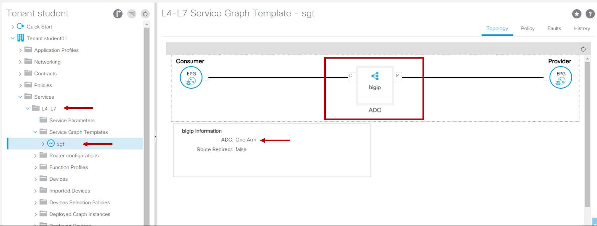

The service graph template has been configured
* One-Arm mode
* Associated to logical device cluster **bigip** 

To deploy the service graph a few steps are needed 1) Assign service graph template to contract 2)Create device selection policy 3) Attach contracts to the correct EPG's

In the left hand pane under your tenant to view the contract click on **Contracts->Standard->cntr**

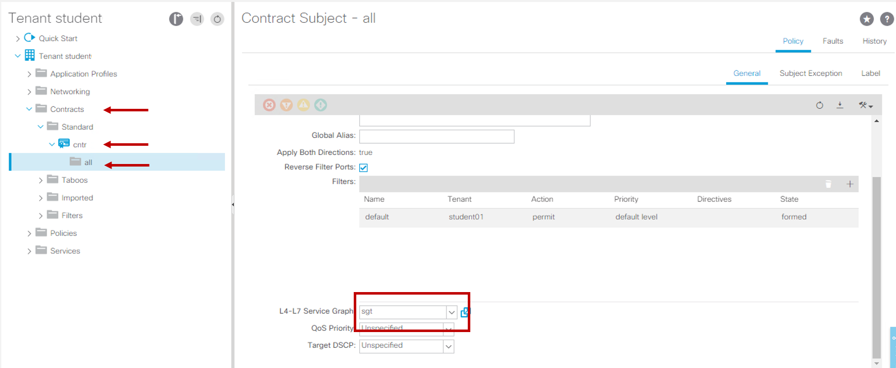

The service graph template **sgt** has been assigned to the contract

In the left hand pane under your tenant to view the device selection policy click on **Services->L4-L7->Device Selection Policy->cntr-sgt-ADC**


The logical device context instructs Cisco Application Centric Infrastructure (ACI) about which load balancer device to use to render a graph. The device **bigip** is assigned for rendering the graph

In the left hand pane under your tenant to view the provided contract assigned to the EPG's click on **Application Profiles->app->Application EPGs->web-epg->Contracts**


Contract **cntr** is assigned as a Provided contract to EPG **web-epg**

In the left hand pane under your tenant to view the consumer contract assigned to the EPG's click on **Networking->External Routed Networks->studentxx-l3out->Networks->epg-l3out** (where studentxx represents your student ID)


Contract **cntr** is assigned as a Consumer contract to EPG **epg-l3out**

In the left hand pane under your tenant to view the deployed graph click on **Services->L4-L7-Deployed Graph Instances**

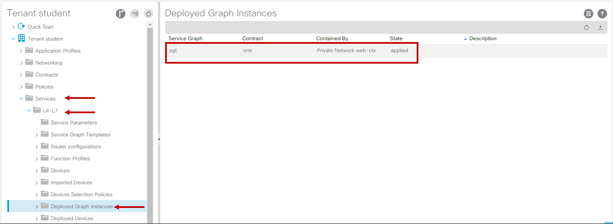

The graph is in state **applied** which indicates it was deployed correctly

### Verify BIG-IP configuration

Let’s log into the F5 BIG-IP **{TBIGIPIP}** with the following username and password from the web browser 

* BIG-IP: **[https://{TBIGIPIP}](https://{TBIGIPIP})**  
* Username: **admin**  
* Password: **cisco123**  

On the left Navigation menu, click the **Network -> VLAN** and you should be able to see the vlan assigned to the interface 1_1

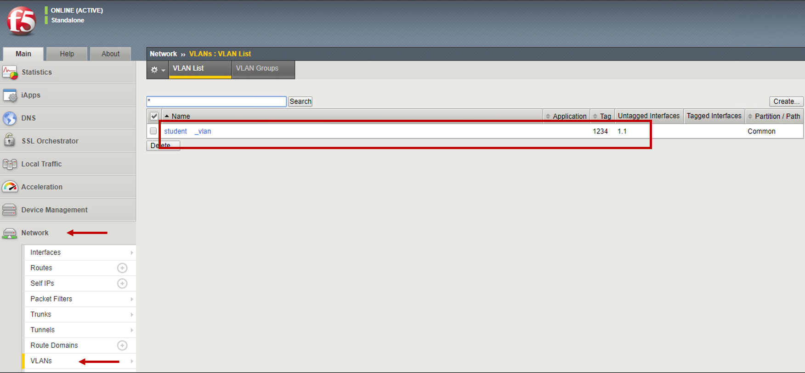

On the left Navigation menu, click the **Network -> Self IPs** and you should be able to see the Self-IP added and assigend to VLAN above

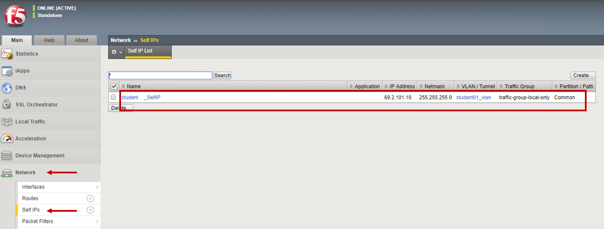

On the left Navigation menu, Click **Local Traffic -> Nodes** and you should see the brief information of the real server pool information


Click **Local Traffic -> Pools** , click on the Pool

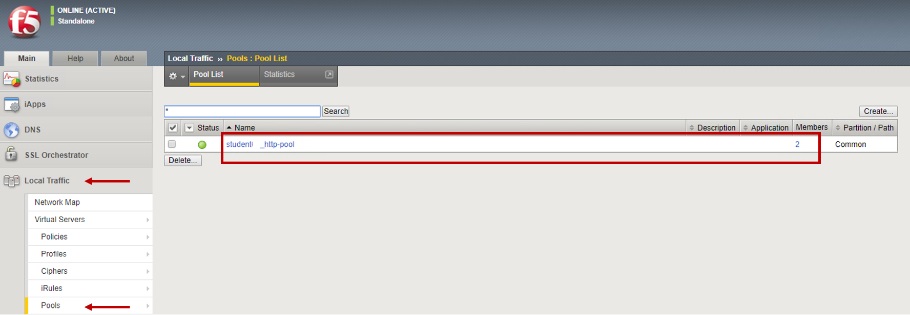

Click the hyperlink under **Name** and you should be directed to the Pool **Properties** page. Now click the **Members** tab and you should see the real servers (pool members) we configured when we were deploying the service graph.

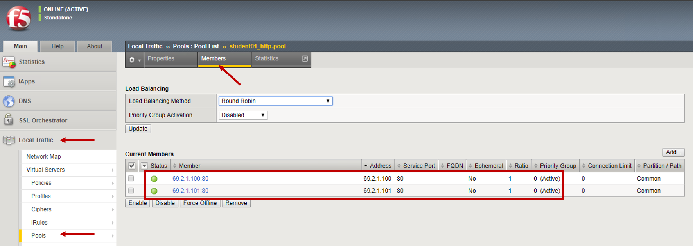

Click the **Local Traffic -> Virtual Servers** and you should be able to see the brief Virtual IP information. You can see that the VIP is currently listening on HTTP port 80.


In the **Virtual Server List**, click the **Name** in the hyperlink and you will see the **Property** of the Virtual Server with more detailed information. The configured the parameters will appear here. 

Click the **Resources** tab and you should see the both **Default** and **Fallback** persistence profiles are set to **None**. Also the **Default Pool** has been set.

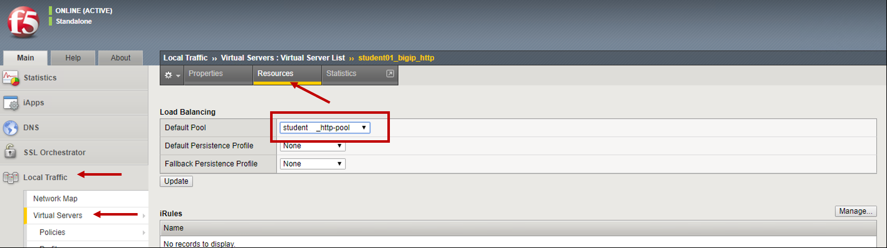

You can now verify the Virtual Server (or VIP) by using your browser and entering the VIP into the address window:  

URL: **[http://{TL2F5VIP}](http://{TL2F5VIP})**  

You should see the page with the hostname of your VMs similar to the following:   

Press the enter button (do not use the refresh button of your browser) at the IP address **{TL2F5VIP}** at the web browser, you should see a different page and the VIP is load balanced by the ADC.

We have verified connectivity to the web server via the ADC VIP.

**This concludes the section for the Lab**

## Automate cleanup on BIG-IP and APIC using Ansible

Connect to the Ansible tower using the following information:
* **Ansible Tower Address**: 172.21.208.250
* **username**: {TSTUDENT}
* **password**: cisco123

Click on **Templates** located in the top level menu: 


Click on the template **Cleanup-BIG-IP**
* This is a view only template. This template will not be launched.
* There is a project associated with the template (which is the GIT project).
* There is a ansible playbook associated with the template (pulled from GIT - bigip_configuration_delete.yaml).

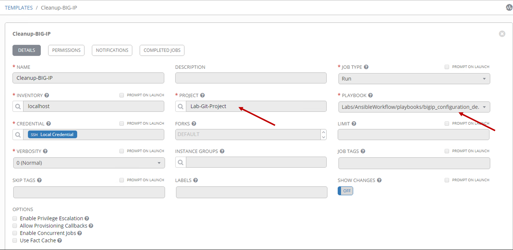

**Playbook contents - bigip_configuration_delete.yaml** - To view contents [click here](https://github.com/f5devcentral/f5-aci-integration-automation-ansible/blob/master/Labs/AnsibleWorkflow/playbooks/bigip_configuration_delete.yaml)
* Calls another playbook named **http_service_cleanup.yaml** to delete L7 configuration. To view contents [click here](https://github.com/f5devcentral/f5-aci-integration-automation-ansible/blob/master/Labs/AnsibleWorkflow/common/http_service_cleanup.yaml)
* Deletes the L7 configuration
	* Node members
	* Pool
	* Virtual Server
* Delete the network configuration
	* VLAN
	* Self-IP
	* Static route

Go back to Ansible Tower, Click on the template **Cleanup-ACI**
* This is a view only template. This template will not be launched.
* There is a project associated with the template (which is the GIT project).
* There is a ansible playbook associated with the template (pulled from GIT - aci_configuration_delete.yaml).

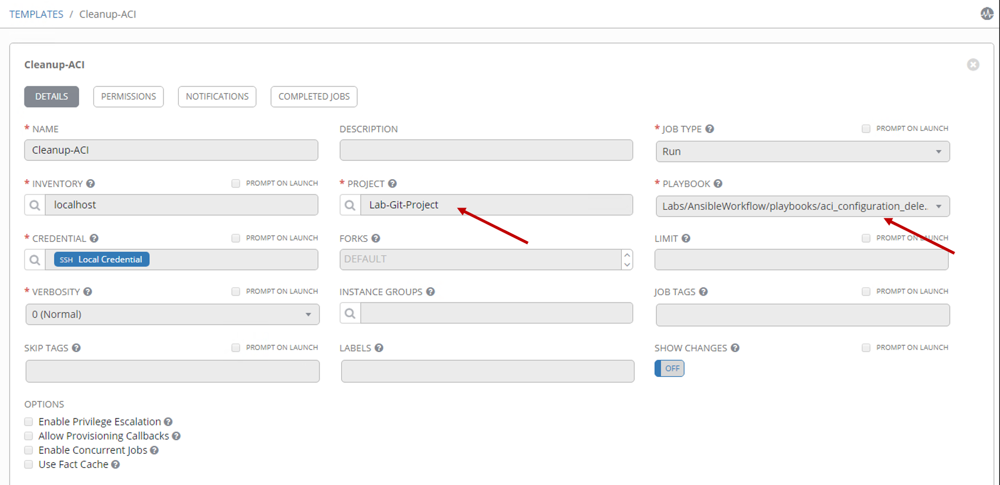

**Playbook contents - aci_configuration_delete.yaml** - To view contents [click here](https://github.com/f5devcentral/f5-aci-integration-automation-ansible/blob/master/Labs/AnsibleWorkflow/playbooks/aci_configuration_delete.yaml)
* Take as input Jinga2 files and covert them to XML files
	* Jinga2 files allow the user to variabalize the content as needed. To view the Jinga2 files used for this playbook [click here](https://github.com/f5devcentral/f5-aci-integration-automation-ansible/tree/master/Labs/AnsibleWorkflow/aci_posts_delete)
* Use the aci_rest Ansible module and post the XML files created in the above step to ACI. Following is what is getting deleted on the APIC. To view the playbook contents [click here](https://github.com/f5devcentral/f5-aci-integration-automation-ansible/blob/master/Labs/AnsibleWorkflow/playbooks/aci_configuration_delete.yaml)
	* Contract
	* Dettach service graph template to contract
		* Device selection policy
		* Unassign provided contract to provider EPG
		* Unassign consumer contract to consumer EPG
	* Service graph template
	* Logical Device Cluster

Go back to Ansible Tower, a workflow has been created in Ansible Tower to chain the execution of the above two playbooks

Click on the template **Cleanup-Workflow**. 
This is a workflow template consisting of two playbooks we viewed earlier
1) Cleanup-BIG-IP
2) Cleanup-ACI

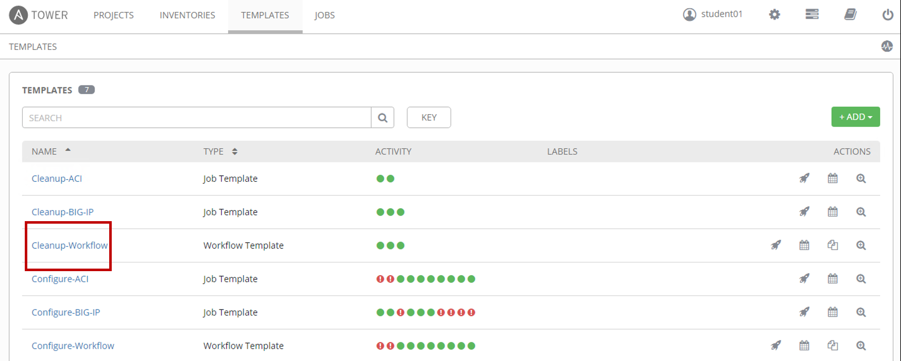

Click on the 'Workflow Editor' button to view the workflow configured

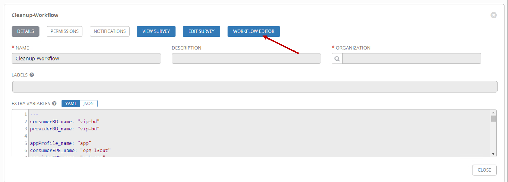

After viewing 'close' the workflow editor

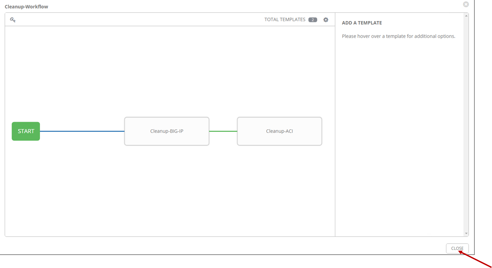

View the parameters in the 'Extra Variables' text box. Values that you provide here will be provided as input to the playbooks in the workflow. We will use the same paramters as used in the configuration workflow. 

Scroll to the bottom and click on the 'Rocket' icon next to the template.


This will launch the playbook. A survey will pop up when the rocket button is clicked. The survey values have default values specified.
Enter the value for the APIC username and APIC tenant to refect you student ID

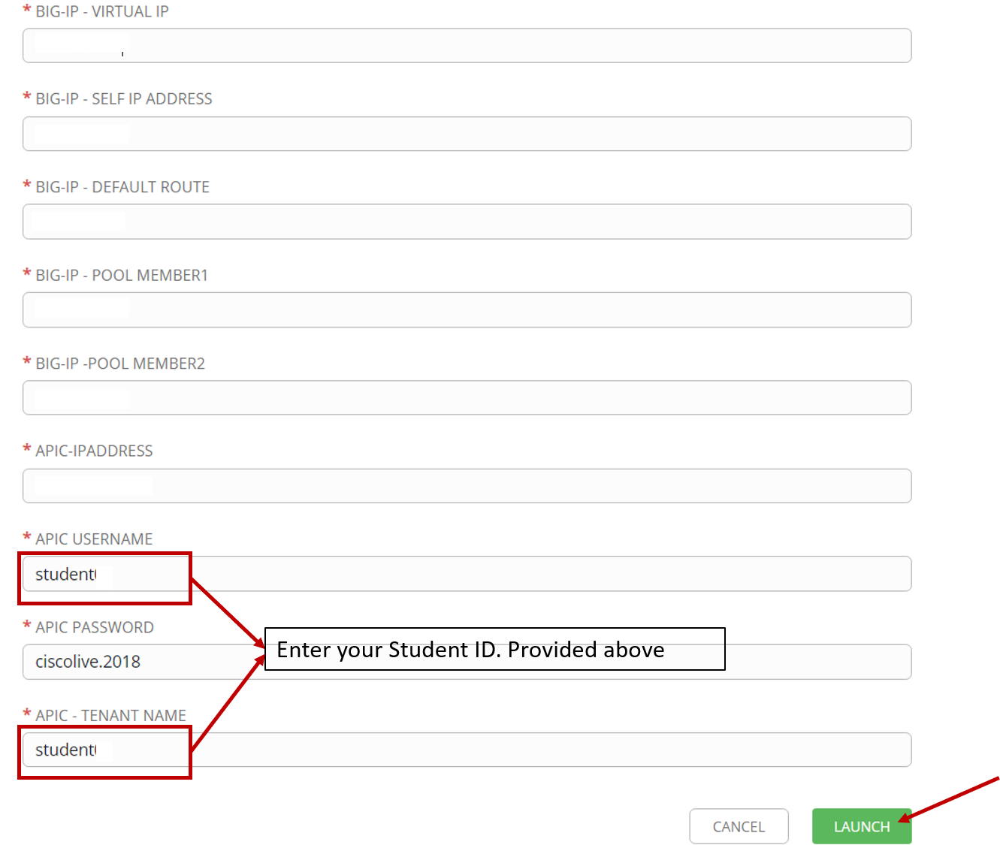

Click next to launch the playbook

At this point the playbook is executing. It will first cleanup the BIG-IP and then the APIC

You will see the status of the playbook is in mode **Pending**. The workflow will first execute Cleanup-BIG-IP playbook. Click on **details**

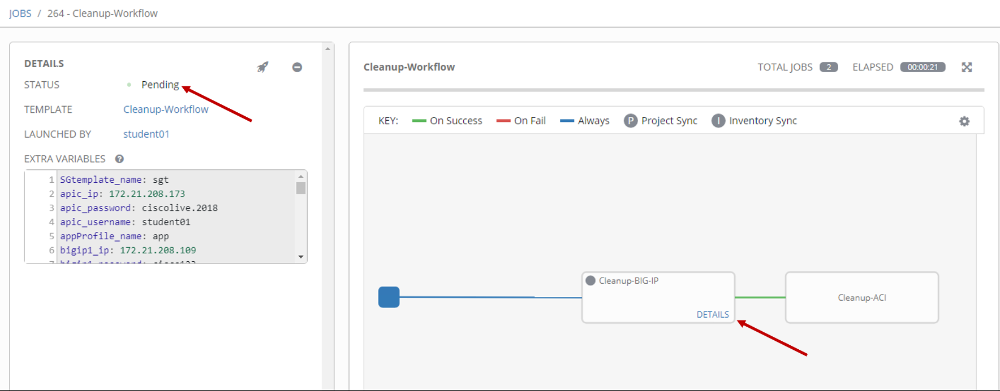

The new window will indicate the progress of running playbook **Cleanup-BIG-IP**

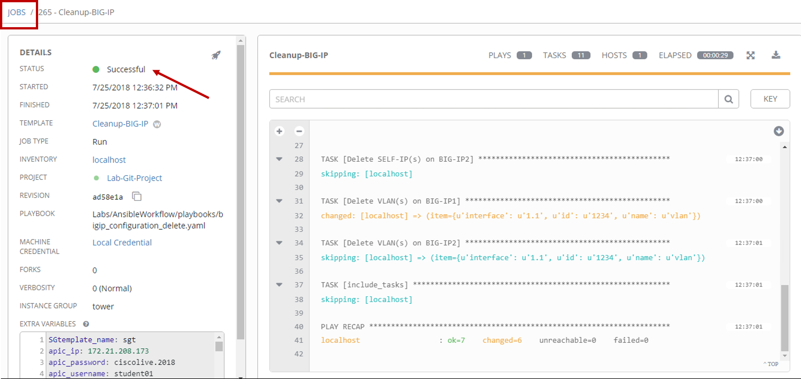

After the playbook has executed sucessfully click on **Jobs** on the top left hand corner

You will see the Cleanup-Workflow job being executed (blinking green icon next to it), click on it. It will take you back to the workflow execution, at this point the **Cleanup-BIG-IP** playbook would have executed sucessfully and the playbook **Cleanup-ACI** will be getting executed. Click on details

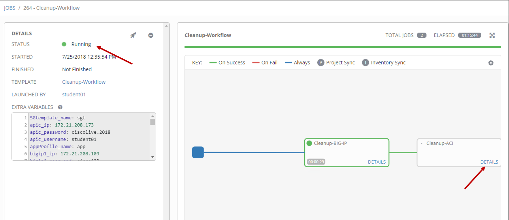

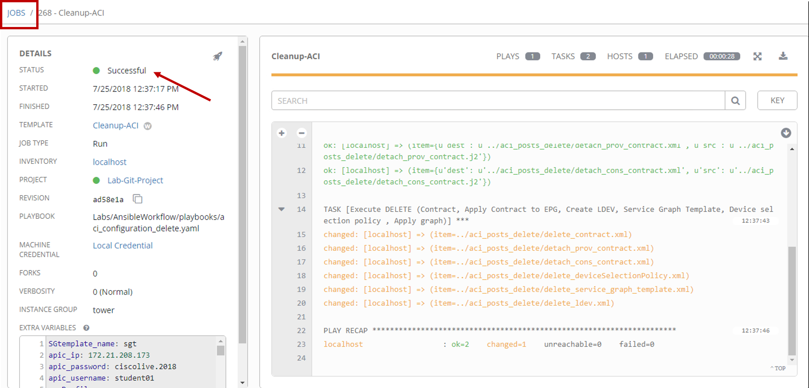

Once the playbook has executed sucessfully again click on **Jobs**. You will see five jobs got executed as part of the workflow. From the bottom

* Git project SCM update (before a playbook is run the GIT repo is updated to make sure the latest code is available)
* Configure-ACI
* Git project SCM update
* Configure-BIG-IP
* Workflow execution

The **JOB ID** in the screen shot does not need to match what you see

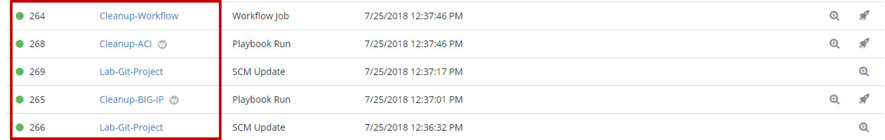

**This concludes the section on using Ansible playbooks to cleanup the APIC and BIG-IP**

## Verifying the cleanup of the deployment

### Verify BIG-IP configuration cleanup

Let’s log into the F5 BIG-IP **{TBIGIPIP}** with the following username and password from the web browser 

* BIG-IP: **[https://{TBIGIPIP}](https://{TBIGIPIP})**  
* Username: **admin**  
* Password: **cisco123**  

Click on the following in the Navigation menu and make sure there is no configuration
* Click the **Network -> VLAN** 
* Click the **Network -> Self IPs** 
* Click **Local Traffic -> Nodes** 
* Click **Local Traffic -> Pools** 
* Click the **Local Traffic -> Virtual Servers** 

### Verify APIC configuration cleanup
Let's login into the APIC with the following username and password from the web browser

* APIC : http://172.21.208.173
* Username: {TSTUDENT}
* Password: ciscolive.2018

On the APIC GUI click on **Tenants**. In the Tenant Search text box enter your student ID. Example: student01. This will open up your tenant on the left hand side of the APIC GUI pane. Navigate to the following and make sure there is no configuration
* Click on **Services->L4-L7->Devices**
* Click on **Services->L4-L7->Service Graph Template**
* Click on **Contracts->Standard**
* Click on **Services->L4-L7->Device Selection Policy**
* Click on **Application Profiles->app->Application EPGs->web-epg->Contracts** 
* Click on **Networking->External Routed Networks->studentxx-l3out->Networks->epg-l3out** (where studentxx represents your student ID)
* Click on **Services->L4-L7-Deployed Graph Instances**

**This concludes the section of the Lab**

>**Congratulations! This session of the lab is completed, please proceed to the next lab session**
