[Introduction](#introduction)

[Pre-requisite](#pre-requisite)

[Topology](#topology)

[Directory structure](#directory-structure)

[Sample APIC logical device configuration](#sample-apic-logical-device-configuration)

[Deployment Models](#deployment-models)

[Standalone Physical BIG-IP](#standalone-physical-big-ip)

[HA Physical BIG-IP](#ha-physical-big-ip)

[SA vCMP BIG-IP](#sa-vcmp-big-ip)

[HA vCMP BIG-IP](#ha-vcmp-big-ip)

[SA Virtual Edition BIG-IP](#sa-virtual-edition-big-ip)

[HA Virtual Edition BIG-IP](#ha-virtual-edition-big-ip)


Introduction
============

Guie on how to Ansible can be used to configure BIG-IP to correspond to the Unmanaged mode of APIC deployment. Goal is to perform L2-L3 stitching between the Cisco ACI fabric and F5 BIG-IP.

Pre-requisite
=============

- Ansible environment ready
    - [Tips: Getting started with ansible](https://devcentral.f5.com/articles/getting-started-with-ansible)
    - Following packages will be needed to be installed after the base ansible package is installed
      - pip install bigsuds
      - pip install f5-sdk
      - pip install netaddr
    
- BIG-IP(s)
    -   Has a MGMT IP assigned to it
    -   Licensed

- APIC
    - Configuration is in place including L4-L7 constructs required to configure BIG-IP in unmanaged mode (logical device cluster, service graph template, contract etc.)

**Note:**

- Physical cabling to the APIC and between the BIG-IP(s) (if setting up HA) is completed
- The APIC configuration DOES NOT need to be present for the ansible playbooks below to work
- The playbooks will NOT configure the APIC, only the BIG-IP

Please go through the [Standalone Physical BIG-IP](#standalone-physical-big-ip) deployment model first since detailed explanation on how to run the playbooks and expected results are provided for this model. Rest of the deployment models will follow the same structure for execution with subtle difference which are mentioned furthur in each deployment model

Topology
========

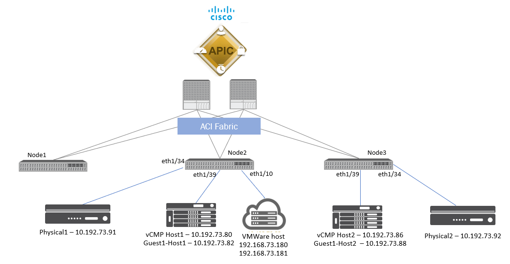

**Physical BIG-IP(s) being used in this example:**

- 192.168.73.91 -- Interface 2.2 of the BIG-IP connected to Node2/eth1-34 on the APIC
- 192.168.73.92 - Interface 2.2 of the BIG-IP connected to Node3/eth1-34 on the APIC
- Interface 1/1.8 on each vCMP host are connected to each other for HA pairing

**vCMP capable BIG-IP(s) being used in this example:**

- Host1 - 192.168.73.80 -- Interface 1/1.3 of the BIG-IP connected toNode2/eth1-39 on the APIC
    - Guest1 -- 192.168.73.82
- Host2 - 192.168.73.86 -- Interface 1/1.3 of the BIG-IP connected to Node3/eth1-39 on the APIC
    - Guest -- 192.168.73.88
- Interface 1/1.8 on each vCMP host are connected to each other for HA pairing

**Virtual Edition BIG-IP(s) being used in this example:**

- 192.168.73.180 -- Esxi host connected to Node2/eth1/10
- 192.168.73.181 -- Esxi host connected to Node2/eth1/10
- Network adaptor 1 used for management
- Network adaptor 2 and 3 used for client and server traffic
- Network adaptor 4 on each host used for HA pairing

**On APIC:**

- Tenant being used -- UM_F5_Tenant
- Logical device cluster for Physical BIG-IPs -- BIGIP_PHY
- Logical device cluster for vCMP capable BIG-IPs -- BIGIP_vCMP
- Logical device cluster for VE of BIG-IPs -- BIGIP_VE

Directory structure
===================

While following the guide below assumption is that all the folders are placed in a directory called **'playbooks'**

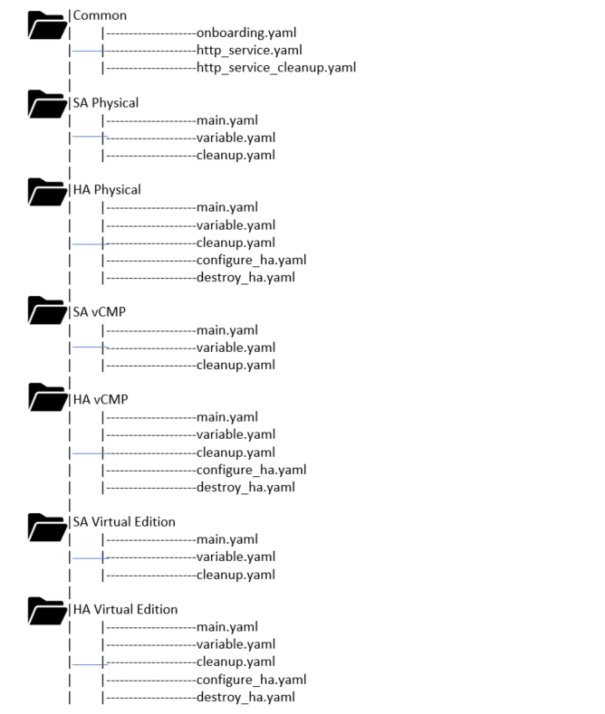

### Sample APIC logical device configuration

This configuration is expected to be present on the APIC prior to running the playbooks. As mentioned above this is NOT a requirement but without the configuration on the APIC there will be no data traffic flowing. It is recommended to have this configuration prior to running the playbooks for the expected result.

#### Logical device configuration for Physical BIG-IP
- Logical device cluster name: BIGIP_PHY
- VLAN tags: 1195 and 1695

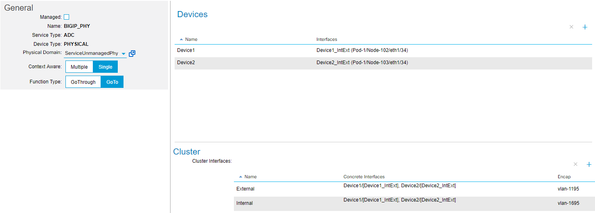

#### Logical device configuration for vCMP enabled BIG-IP
- Logical device cluster name: BIGIP_vCMP
- VLAN tags: 1196 and 1696

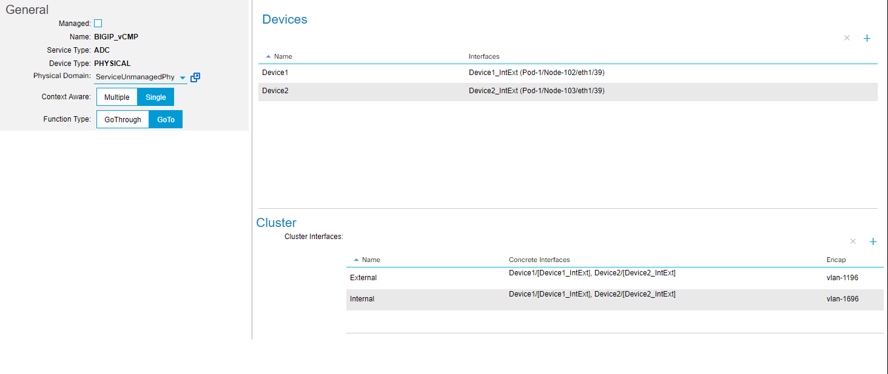

#### Logical device configuration for VE of BIG-IP
- Logical device cluster name: BIGIP_VE
- For VE the VLAN tags are not specified at the logical device cluster level but when the service graph is deployed 

#### 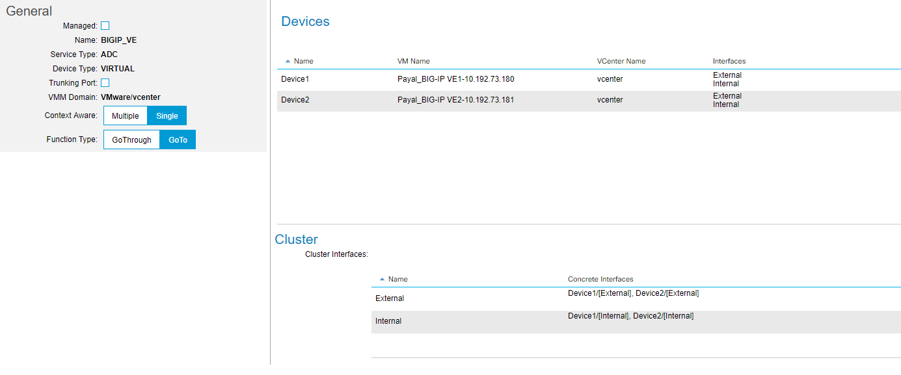

Deployment Models
=================

Standalone Physical BIG-IP
--------------------------

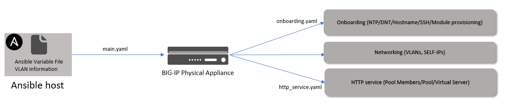

The user will need to execute only one playbook which is the main.yaml file for this particular deployment scenrario.

[Click here for scripts](https://github.com/f5devcentral/f5-aci-integration-automation-ansible/tree/master/integration-guide/sa_phy)

### Variable file

- The variable file will contain VLAN tags along with other information.The VLAN tags should match the VLAN tags configured on APIC in the logical device cluster.
- The ansible playbook will only configure the BIG-IP.

This variable file is designed to configure the following on the BIG-IP

- Onboarding : NTP, DNS, Hostname, SSH settings, Module provisioning
- Networking: 2 VLAN's, 2 Self-IP's, SNAT
    - This represents a 2 ARM mode BIG-IP connection to the APIC
        - Same interface on the BIG-IP will be used for client and server traffic
        - Separate VLAN for client and server traffic is tagged on the BIG-IP interface
    - SNAT is set to none (Assumption: Backend servers have the BIG-IP as their default gateway)
- HTTP service: Pool members, Pool, Virtual Server

### Sample variable file used
```
onboarding: "yes"                                   Do you want to onboard the BIG-IP - Options: yes/no
banner_text: "--Standalone BIG-IP UnManaged ---"    SSH banner text
	
hostname: 'bigip.local'	                            Hostname of the BIG-IP (Part of onboarding)
	
ntp_servers:	                                    NTP servers to be configured (Part of onboarding)
 - '172.27.1.1'	
 - '172.27.1.2'	
	
dns_servers:	                                    DNS servers to be configured (Part of onboarding)
 - '8.8.8.8'	
 - '4.4.4.4'	
ip_version: 4	
	
module_provisioning:	                            Modules to be provisioned on BIG-IP (Part of onboarding)
 - name: 'ltm'	
   level: 'nominal'	
	
tenant_name_aci: "UM_F5_Tenant"	                    APIC tenant name
ldev_name_aci: "BIGIP_PHY"	                    APIC logical device cluster name
	
	
bigip_ip: 10.192.73.91	                            BIG-IP credentials
bigip_username: "admin"	
bigip_password: "admin"	
	
vlan_information:                                   VLAN to be added to BIG-IP
- name: "External_VLAN"                             VLAN’s match what is present in the logical device cluster BIGIP_PHY
  id: "1195"
  interface: "2.2"
- name: "Internal_VLAN"
  id: "1695"
  interface: "2.2"
	   
static_route:	                                    Add a static route
- name: "default"
  gw_address: "10.168.56.1"
  destination: "0.0.0.0"
  netmask: "0.0.0.0"
  
bigip_selfip_information:                           Self-IP to be added to BIG-IP, tag the appropriate VLAN to the respective Self-IP
- name: 'External-SelfIP'
  address: '10.168.68.10'
  netmask: '255.255.255.0'
  vlan: "{{vlan_information[0]['name']}}"
- name: 'Internal-SelfIP'
  address: '192.168.68.10'
  netmask: '255.255.255.0'
  vlan: "{{vlan_information[1]['name']}}"	
  
service: "yes"	                                    Do you want to configure HTTP service on the BIG-IP -Options: yes/no
	
vip_name: "http_vs"	                            VIP information (Part of configuring HTTP service)
vip_port: "80"	
vip_ip: "10.168.68.105"
	
snat: "None"                                        Options: ‘None/Automap/snat-pool name’
pool_name: "web-pool"	                            Pool Information (Part of configuring HTTP service)
pool_members:	
- port: "80"	
  host: "192.168.68.140"	
- port: "80"	
  host: "192.168.68.141"	

```

If a different scenario is needed to be configured, for example BIG-IP in one arm mode, then the variable file will need to be modified
accordingly. The onboarding and http service sections will remain the same.

- VLAN and Self-IP -- only 1 entry will be needed
- SNAT: Automap can be used

### Example of the changes to the variable file
```
vlan_information:
- name: "External_VLAN"
  id: "1195"
  interface: "2.2”

bigip_selfip_information:
- name: 'External-SelfIP'
  address: '10.168.68.10'
  netmask: '255.255.255.0'
  vlan: "{{vlan_information[0]['name']}}"

snat: "Automap"
```

### Playbook execution

The main.yaml playbook will be executed. Sequence of events

- If onboarding is set to 'yes' then the onboarding.yaml playbook will be executed
- Network constructs will be configured on the BIG-IP
    - The name of the VLAN and SELF-IP will tie it to an APIC tenant
- If service is set to 'yes' then the http_service.yaml playbook will be executed
    - The name of the virtual server will tie it to an APIC tenant and LDEV

**Command to execute playbook**
Make sure you are in executing the playbook for the correct deployment scenario from the appropriate directory. (Directory: sa_phy)
-   ansible-playbook playbooks/sa_phy/main.yaml

**Sample of playbook execution**
```
ansible-playbook playbooks/sa_phy/main.yaml

PLAY [Standalone Physical Unmanaged Mode BIG-IP setup] ***************************************************************

TASK [include_tasks] *************************************************************************************************
included: /root/ps_ansible/playbooks/common/onboarding.yaml for localhost

TASK [Configure NTP server on BIG-IP] ********************************************************************************
changed: [localhost -> localhost]

TASK [Configure BIG-IP hostname] *************************************************************************************
changed: [localhost -> localhost]

TASK [Manage SSHD setting on BIG-IP] *********************************************************************************
changed: [localhost -> localhost]

TASK [Manage BIG-IP DNS settings] ************************************************************************************
changed: [localhost -> localhost]

TASK [Provision BIG-IP with appropriate modules] *********************************************************************
ok: [localhost -> localhost] => (item={u'name': u'ltm', u'level': u'nominal'})

TASK [Add VLAN(s)] ***************************************************************************************************
changed: [localhost] => (item={u'interface': u'2.2', u'name': u'External_VLAN', u'id': u'1195'})
changed: [localhost] => (item={u'interface': u'2.2', u'name': u'Internal_VLAN', u'id': u'1695'})

TASK [Add SELF-IP(s)] ************************************************************************************************
changed: [localhost] => (item={u'netmask': u'255.255.255.0', u'vlan': u'External_VLAN', u'name': u'External-SelfIP', u'address': u'10.168.56.10'})
changed: [localhost] => (item={u'netmask': u'255.255.255.0', u'vlan': u'Internal_VLAN', u'name': u'Internal-SelfIP', u'address': u'192.168.56.10'})

TASK [Add route(s)] **************************************************************************************************
changed: [localhost -> localhost] => (item={u'gw_address': u'10.168.56.1', u'netmask': u'0.0.0.0', u'destination': u'0.0.0.0', u'name': u'default'})

TASK [include_tasks] *************************************************************************************************
included: /root/ps_ansible/playbooks/common/http_service.yaml for localhost

TASK [Create nodes] **************************************************************************************************
changed: [localhost -> localhost] => (item={u'host': u'192.168.56.140', u'port': u'80'})
changed: [localhost -> localhost] => (item={u'host': u'192.168.56.141', u'port': u'80'})

TASK [Create pool] ***************************************************************************************************
changed: [localhost -> localhost]

TASK [Add Pool members] **********************************************************************************************
changed: [localhost -> localhost] => (item={u'host': u'192.168.56.140', u'port': u'80'})
changed: [localhost -> localhost] => (item={u'host': u'192.168.56.141', u'port': u'80'})

TASK [Add Virtual Server] ********************************************************************************************
changed: [localhost -> localhost]

PLAY RECAP ***********************************************************************************************************
111

```
Contets of the main playbook

**Main.yaml**
```
- name: SA Physical Unmanaged Mode BIG-IP setup	
  hosts: localhost	
  connection: local	
  gather_facts: false	
	
  vars_files:						Include the variable file above
    - variable.yaml	
	
  tasks:	
	
  - include_tasks: ../common/onboarding.yaml		Onboarding playbook will be executed 
    when: '"yes" in onboarding '	
	
  - name: Add VLAN(s)					VLAN(s) will be added
    bigip_vlan:	
      server: "{{bigip_ip}}"	
      user: "{{ bigip_username }}"	
      password: "{{ bigip_password }}"	
      name: "{{tenant_name_aci}}_{{item.name}}"		Name will tie it to a APIC tenant
      tag: "{{item.id}}"	
      tagged_interfaces:				Interface will be tagged
      - "{{item.interface}}"	
      validate_certs: "no"	
    with_items: "{{vlan_information}}"	
	
  - name: Add SELF-IP(s)				Self-IP will be added
    bigip_selfip:	
     server: "{{bigip_ip}}"	
     user: "{{ bigip_username }}"	
     password: "{{ bigip_password }}"	
     name: "{{tenant_name_aci}}_{{item.name}}"		Name will tie it to a APIC tenant
     address: "{{item.address}}"	
     netmask: "{{item.netmask}}"	
     vlan: "{{tenant_name_aci}}_{{item.vlan}}"	
     validate_certs: "no"	
    with_items: "{{ bigip_selfip_information }}"	

- name: Add route(s)
    bigip_static_route:
      server: "{{bigip_ip}}"
      user: "{{ bigip_username }}"
      password: "{{ bigip_password }}"
      name: "{{item.name}}"
      gateway_address: "{{item.gw_address}}"
      netmask: "{{item.netmask}}"
      destination: "{{item.destination}}"
      validate_certs: "no"
    with_items: "{{static_route}}"
    delegate_to: localhost
	
  - include_tasks: ../common/http_service.yaml		Service (VIP/Pool/Members) playbook will be executed
    when: '"yes" in service '	

```
To view contents of playbook of other playbooks please go to github repo where the [files are located](link) 

After running the playbook login to the BIG-IP and check all the objects are configured


To perform a cleanup of the BIG-IP configuration, run the following playbook:

- ansible-playbook playbooks/sa_phy/cleanup.yaml

This will remove all the objects configured by the above playbook (VS/pools/nodes/Self-IPs/VLANS)

```
ansible-playbook playbooks/sa_phy/cleanup.yaml

PLAY [Cleanup Standalone Physical Unmanaged Mode BIG-IP setup] *******************************************************

TASK [include_tasks] *************************************************************************************************
included: /root/ps_ansible/playbooks/common/http_service_cleanup.yaml for localhost

TASK [Delete Virtual Server] *****************************************************************************************

changed: [localhost -> localhost]

TASK [Delete pool] ***************************************************************************************************
changed: [localhost -> localhost]

TASK [Delete nodes] **************************************************************************************************
changed: [localhost -> localhost] => (item={u'host': u'192.168.56.140', u'port': u'80'})
changed: [localhost -> localhost] => (item={u'host': u'192.168.56.141', u'port': u'80'})

TASK [Delete route(s)] ***********************************************************************************************
changed: [localhost -> localhost] => (item={u'gw_address': u'10.168.56.1', u'netmask': u'0.0.0.0', u'destination': u'0.0.0.0', u'name': u'default'})

TASK [Delete SELF-IP(s)] *********************************************************************************************
changed: [localhost] => (item={u'netmask': u'255.255.255.0', u'vlan': u'External_VLAN', u'name': u'External-SelfIP', u'address': u'10.168.56.10'})
changed: [localhost] => (item={u'netmask': u'255.255.255.0', u'vlan': u'Internal_VLAN', u'name': u'Internal-SelfIP', u'address': u'192.168.56.10'})

TASK [Delete VLAN(s)] ************************************************************************************************
changed: [localhost] => (item={u'interface': u'2.2', u'name': u'External_VLAN', u'id': u'1195'})
changed: [localhost] => (item={u'interface': u'2.2', u'name': u'Internal_VLAN', u'id': u'1695'})

PLAY RECAP ***********************************************************************************************************
localhost                  : ok=7    changed=6    unreachable=0    failed=0
```

HA Physical BIG-IP
------------------

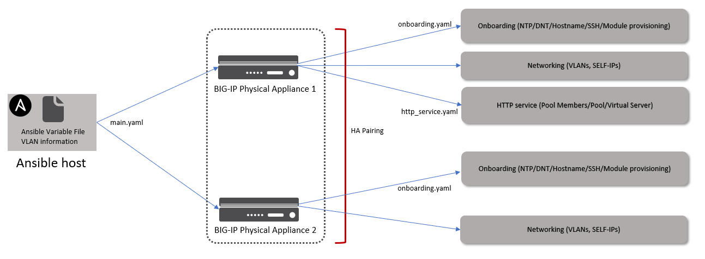

The playbook along with configuration as done on the standalone physical setup will also configure

- HA setup between the two BIG-IP's
- Onboarding tasks on both BIG-IP's
- Floating-IP(s) setup on the BIG-IP

[Click here for scripts](https://github.com/f5devcentral/f5-aci-integration-automation-ansible/tree/master/integration-guide/ha_phy)

### Variable file

Variable file will have additional information needed to setup the BIG-IP HA pair

### Playbook

**Command to execute playbook**
Make sure you are in executing the playbook for the correct deployment scenario from the appropriate directory. (Directory: ha_phy)
-   ansible-playbook playbooks/ha_phy/main.yaml

The main.yaml playbook will be executed. Sequence of events

- If onboarding is set to 'yes' then the onboarding.yaml playbook will be executed on both BIG-IPs
- HA pairing will be configured
- Network constructs will be configured on the both the BIG-IPs
    - The name of the VLAN and SELF-IP will tie it to an APIC tenant
- If service is set to 'yes' then the http_service.yaml playbook will be executed on one BIG-IP (configuration will be synced automatically between the pair of BIG-IPs)
    - The name of the virtual server will tie it to an APIC tenant and LDEV

After running the playbook login to both the BIG-IP and that check all the objects are configured and HA pairing has been done.

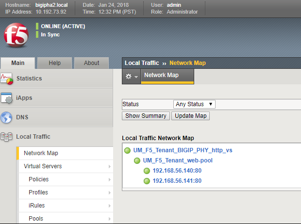

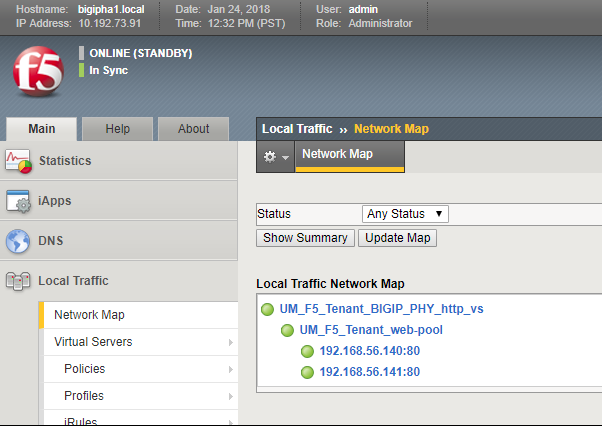

To perform a cleanup of the BIG-IP configuration, run the following playbook:

-   ansible-playbook playbooks/ha_phy/cleanup.yaml

This will remove all the objects configured by the above playbook (VS/pools/nodes/Self-IPs/VLANS). It will also remove all the objects
that setup HA (HA pairing will be destroyed)

SA vCMP BIG-IP
--------------

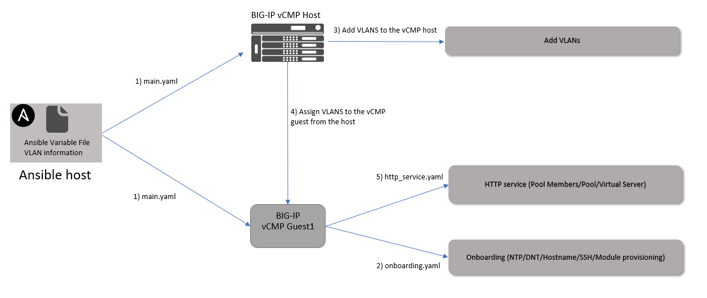

- The variable file will contain VLAN tags along with other information.The VLAN tags should match the VLAN tags configured on APIC in the logical device cluster.
- The ansible playbook will only configure the BIG-IP.

[Click here for scripts](https://github.com/f5devcentral/f5-aci-integration-automation-ansible/tree/master/integration-guide/sa_vcmp)

### Variable file

This file will contain all the information needed to configure the BIG-IP. This variable file is designed to configure the following on the BIG-IP

- Onboarding the vCMP guest : NTP, DNS, Hostname, SSH settings, Module provisioning
- VLAN's added to the vCMP host
- VLAN's assigned from the vCMP host to the vCMP guest
- 2 Self-IP's, SNAT on the vCMP guest
    - This represents a 2 ARM mode BIG-IP connection to the APIC
        - VLAN is tagged on a BIG-IP interface
    - SNAT is set to none (Assumption: Backend servers have the BIG-IP as their default gateway)
- HTTP service: Pool members, Pool, Virtual Server on the vCMP guest

### Playbook

**Command to execute playbook**
Make sure you are in executing the playbook for the correct deployment scenario from the appropriate directory. (Directory: sa_vcmp)
-   ansible-playbook playbooks/sa_vcmp/main.yaml

The main.yaml playbook will be executed. Sequence of events

- If onboarding is set to 'yes' then the tasks in the onboarding.yaml playbook will be executed on the vCMP guest
- Network constructs will be configured on the BIG-IP
    - VLAN will be configured on the vCMP host and then assigned to the vCMP guest
    - SELF-IP will tie it to an APIC tenant
- If service is set to 'yes' then the http_service.yaml playbook will be executed
    - The name of the virtual server will tie it to an APIC tenant and LDEV

After running the playbook login to both the vCMP host and guest and check all the objects are configured

VLAN's from the vCMP host are assigned to the vCMP guest
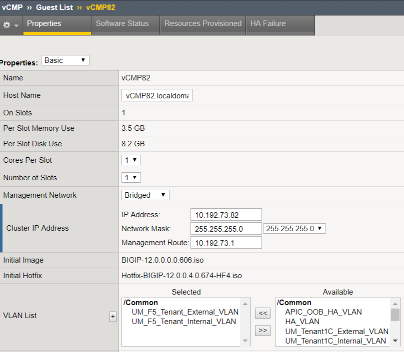

Objects configured on the vCMP guest
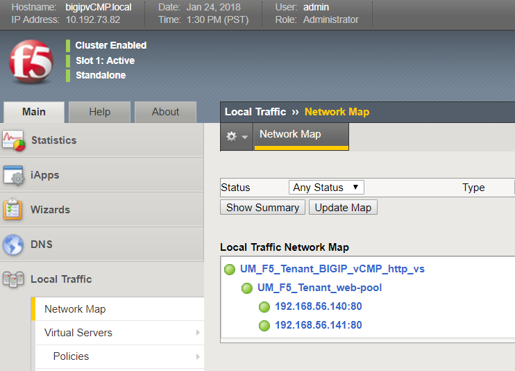

To perform a cleanup of the BIG-IP configuration, run the following playbook:

-   ansible-playbook playbooks/sa_vcmp/cleanup.yaml

This will remove all the objects configured by the above playbook on the vCMP guest (VS/pools/nodes/Self-IPs/VLANS). It will also remove
objects configured on the vCMP host.

HA vCMP BIG-IP
--------------

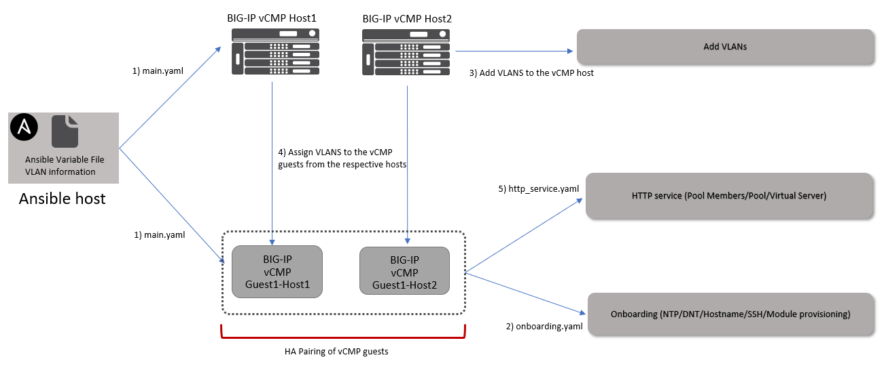

- The variable file will contain VLAN tags along with other information.The VLAN tags should match the VLAN tags configured on APIC in the logical device cluster.
- The ansible playbook will only configure the BIG-IP.

[Click here for scripts](https://github.com/f5devcentral/f5-aci-integration-automation-ansible/tree/master/integration-guide/ha_vcmp)

### Variable file

This file will contain all the information needed to configure the BIG-IP. This variable file is designed to configure the following on the BIG-IP

- Onboarding the vCMP guest : NTP, DNS, Hostname, SSH settings, Module provisioning
- VLAN's, added to the vCMP host
- VLAN's assigned from the vCMP host to the vCMP guest
- 2 Self-IP's, SNAT on the vCMP guest
    - This represents a 2 ARM mode BIG-IP connection to the APIC
        - VLAN is tagged on a BIG-IP interface
    - SNAT is set to none (Assumption: Backend servers have the BIG-IP as their default gateway)
- HTTP service: Pool members, Pool, Virtual Server on the vCMP guest

### Playbook

**Command to execute playbook**
Make sure you are in executing the playbook for the correct deployment scenario from the appropriate directory. (Directory: ha_vcmp)
-   ansible-playbook playbooks/ha_vcmp/main.yaml

The main.yaml playbook will be executed. Sequence of events

- If onboarding is set to 'yes' then the tasks in the onboarding.yaml playbook will be executed on the vCMP guest
- HA pairing between the vCMP guests will be configured
- Network constructs will be configured on the BIG-IP
    - VLAN will be configured on the vCMP host and then assigned to the vCMP guest
    - SELF-IP will tie it to an APIC tenant
- If service is set to 'yes' then the http\_service.yaml playbook will be executed
    - The name of the virtual server will tie it to an APIC tenant and LDEV

After running the playbook login to both the vCMP hosts and guests and check all the objects are configured

VLAN's from the vCMP host1 are assigned to the vCMP guest
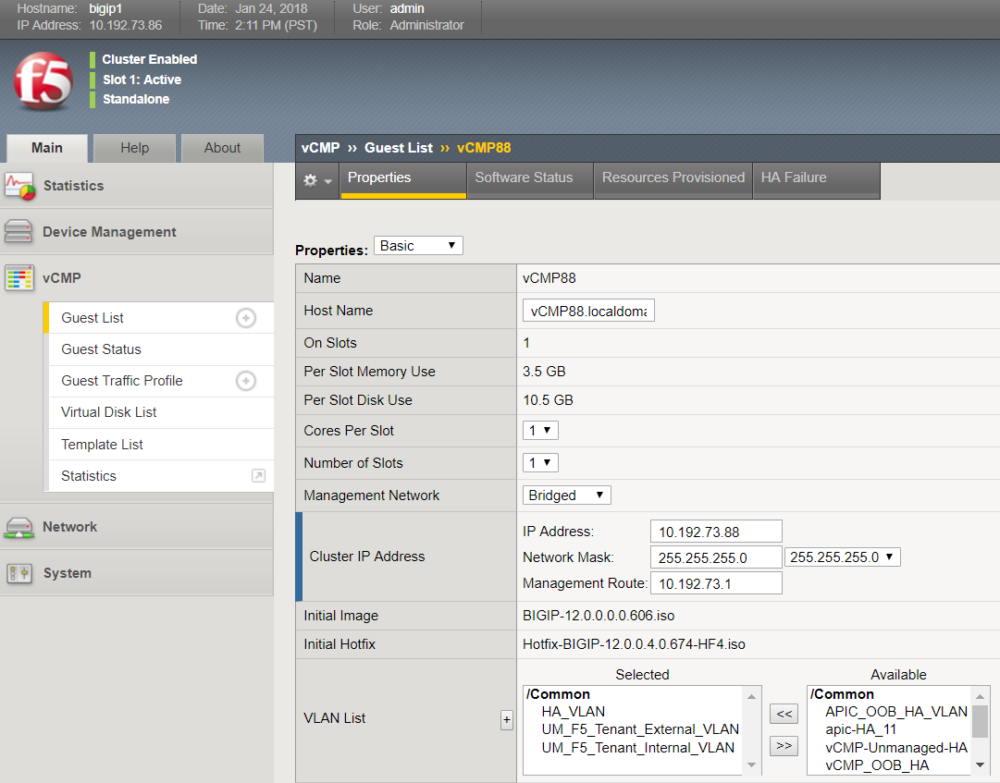

Objects are configured on the vCMP guest and HA pairing is achieved
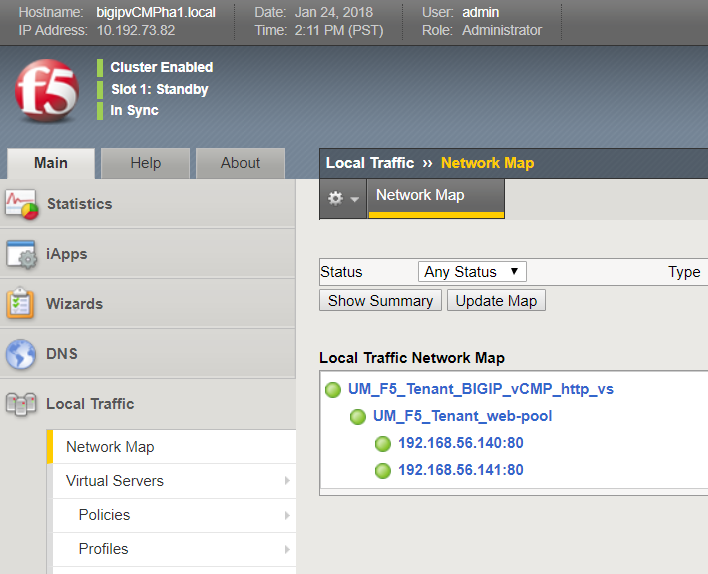

VLAN's from the vCMP host2 are assigned to the vCMP guest
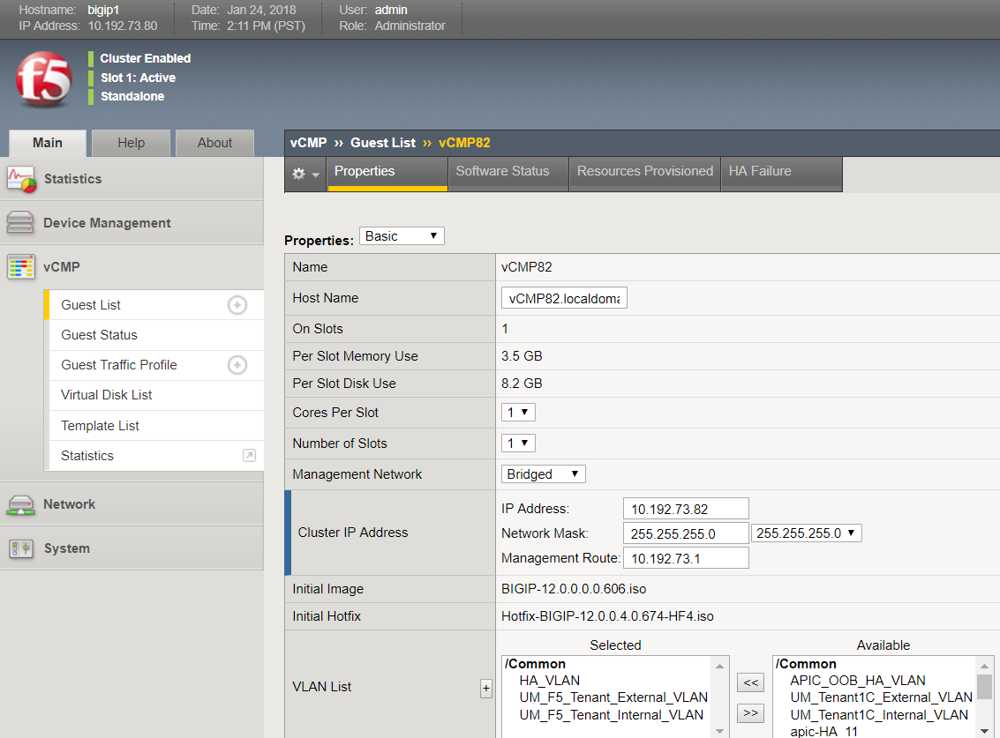

Objects are configured on the vCMP guest and HA pairing is achieved


To perform a cleanup of the BIG-IP configuration, run the following playbook:

-   ansible-playbook playbooks/ha_vcmp/cleanup.yaml

This will remove all the objects configured by the above playbook on the vCMP guest (VS/pools/nodes/Self-IPs/VLANS). It will also remove
objects configured on the vCMP host. HA pairing will also be destroyed

SA Virtual Edition BIG-IP
-------------------------

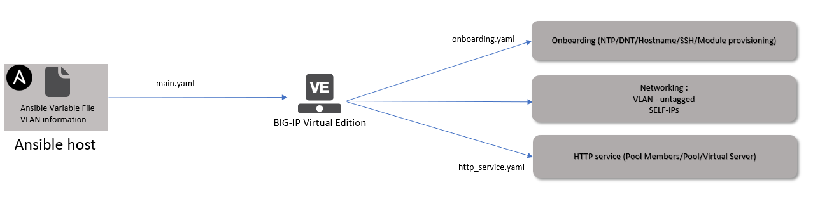

- The variable file will contain VLAN tags along with other information. The VLAN tags should match the VLAN tags assigned by APIC once the service graph is deployed. 
- The ansible playbook will only configure the BIG-IP.

VLAN's on the APIC after a service graph is deployed. These are the values that should be provided in your variable file
- VLANS : 1881 and 1848

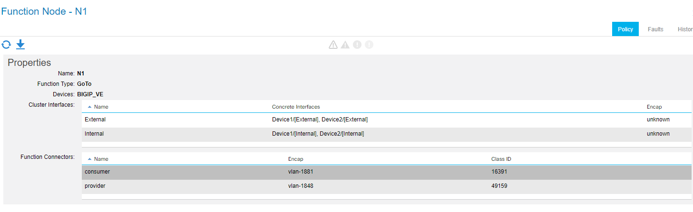

[Click here for scripts](https://github.com/f5devcentral/f5-aci-integration-automation-ansible/tree/master/integration-guide/sa_ve)

### Variable file

This variable file is designed to configure the following on the BIG-IP

- Onboarding: NTP, DNS, Hostname, SSH settings, Module provisioning
- Networking: VLAN's, Self-IPs
- HTTP service: Pool members, Pool, Virtual Server

### Playbook

**Command to execute playbook**
Make sure you are in executing the playbook for the correct deployment scenario from the appropriate directory. (Directory: sa_ve)
-   ansible-playbook playbooks/sa_ve/main.yaml

The main.yaml playbook will be executed. Sequence of events
- If onboarding is set to 'yes' then the tasks in the onboarding.yaml playbook will be executed
- Network constructs will be configured on the BIG-IP (VLAN and Self-IP)
    - The VLAN will be untagged on the respective interface
- If service is set to 'yes' then the http\_service.yaml playbook will be executed
    - The name of the virtual server will tie it to an APIC tenant and LDEV

After running the playbook login to the BIG-IP and check all the objects are configured

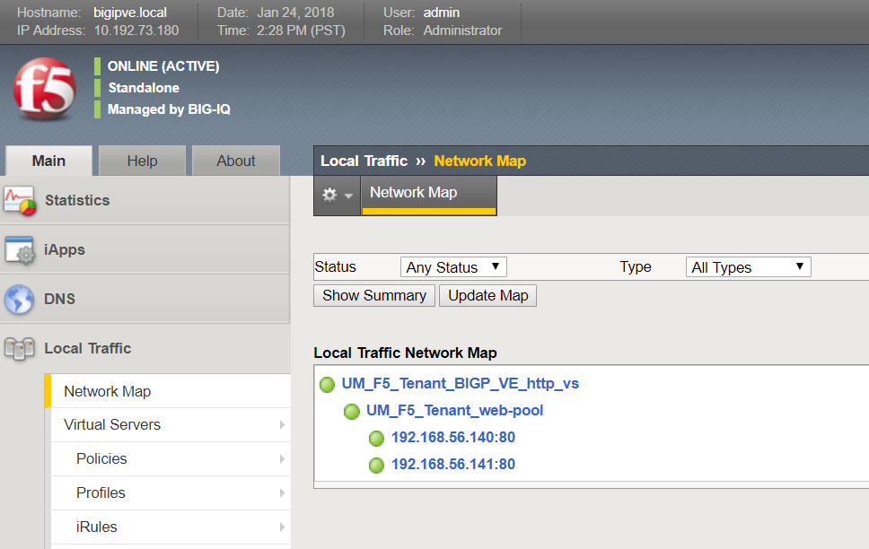

To perform a cleanup of the BIG-IP configuration, run the following playbook:

-   ansible-playbook playbooks/sa_ve/cleanup.yaml

This will remove all the objects configured by the above playbook (VS/pools/nodes/Self-IPs/VLANS)

HA Virtual Edition BIG-IP
-------------------------

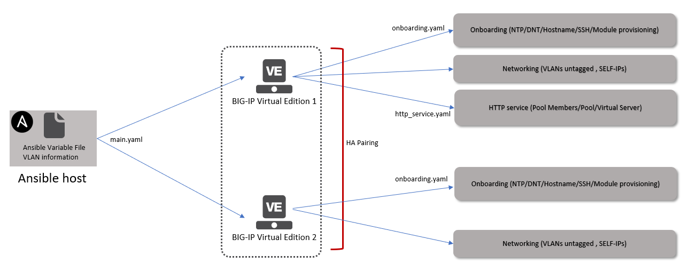

- The variable file will contain VLAN tags along with other information. The VLAN tags should match the VLAN tags assigned by APIC once the service graph is deployed.
- The ansible playbook will only configure the BIG-IP.

VLAN's on the APIC after a service graph is deployed. These are the values that should be provided in your variable file
- VLANS : 1881 and 1848


The playbook along with configuration as done on the standalone VE setup will also configure

-   HA setup between the two BIG-IP's
-   Onboarding tasks on both BIG-IP's
-   Floating-IP(s) setup on the BIG-IP

[Click here for scripts](https://github.com/f5devcentral/f5-aci-integration-automation-ansible/tree/master/integration-guide/ha_ve)

### Variable file

Variable file will have additional information needed to setup the BIG-IP HA pair

### Playbook

**Command to execute playbook**
Make sure you are in executing the playbook for the correct deployment scenario from the appropriate directory. (Directory: ha_ve)
-   ansible-playbook playbooks/ha_ve/main.yaml

The main.yaml playbook will be executed. Sequence of events

- If onboarding is set to 'yes' then the onboarding.yaml playbook will be executed on both BIG-IPs
- HA pairing will be configured
- Network constructs will be configured on the both the BIG-IPs
    - The name of the VLAN and SELF-IP will tie it to an APIC tenant
- If service is set to 'yes' then the http\_service.yaml playbook will be executed on one BIG-IP (configuration will be synced automatically between the pair of BIG-IPs)
    - The name of the virtual server will tie it to an APIC tenant and
        LDEV

After running the playbook login to both the BIG-IP and that check all the objects are configured and HA pairing has been done.

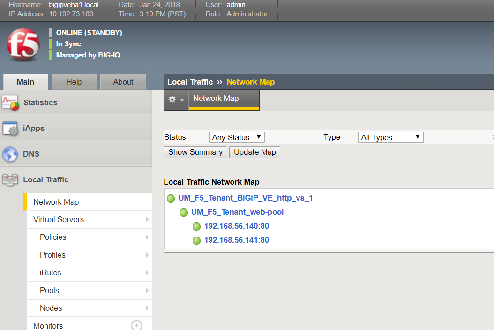

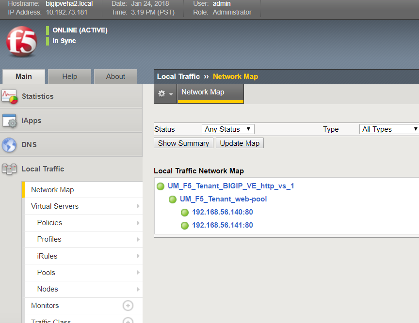


To perform a cleanup of the BIG-IP configuration, run the following playbook:

-   ansible-playbook playbooks/ha_ve/cleanup.yaml

This will remove all the objects configured by the above playbook (VS/pools/nodes/Self-IPs/VLANS). It will also remove all the objects
that setup HA (HA pairing will be destroyed)
